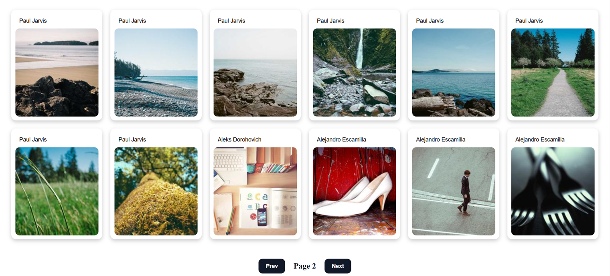

# PicStream

A responsive image gallery built with React, Axios, and CSS Grid.

## Features

- Fetches images from the Picsum API
- Paginated gallery
- Loading indicator during API requests
- Responsive grid layout for desktop and mobile devices
- Hover interactions on image cards
- Open full-size images in a new tab

## Preview

## Tech Stack

- React
- Axios
- Vite
- CSS3